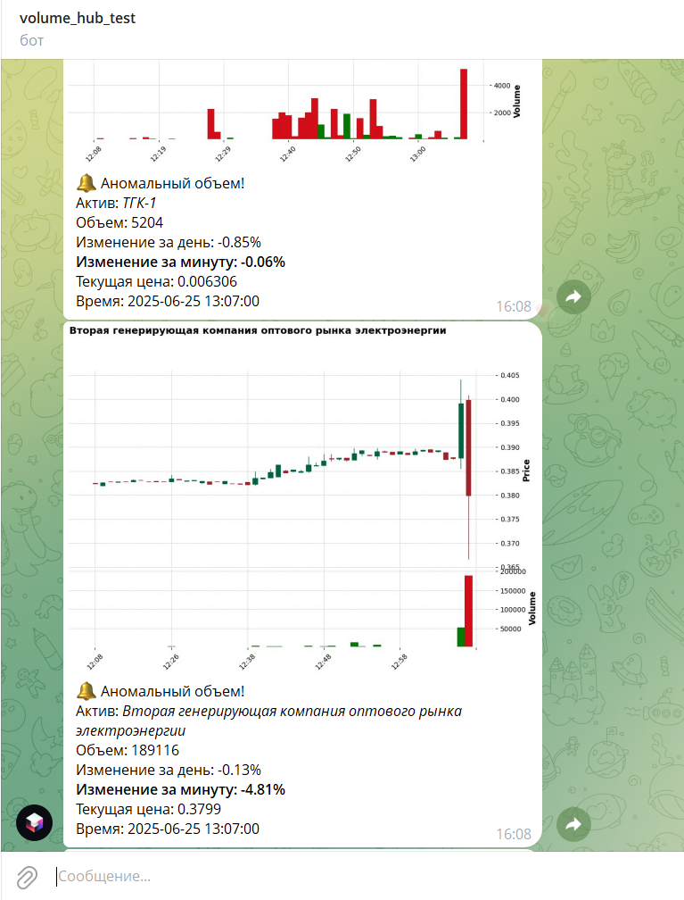
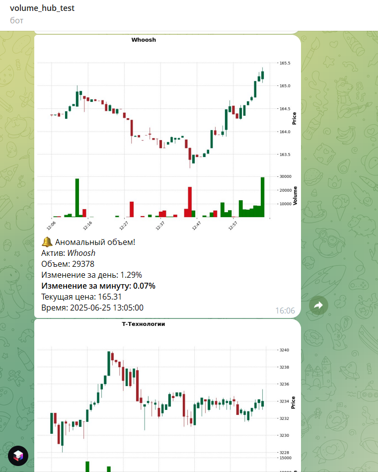

# VolumeHub

       

## О проекте

VolumeHub - это микросервисная система для анализа биржевых данных, отслеживания аномалий в торговых объемах и оповещения через Telegram. Система обрабатывает данные в реальном времени и исторические данные.

## Архитектура

Проект состоит из четырех основных компонентов:

### 1. API Gateway (api-gateway)
- Единая точка входа в систему
- Маршрутизация запросов между сервисами
- Документация API (OpenAPI/Swagger)

### 2. API T-Connector (api-T-connector)
- Взаимодействие с Tinkoff API
- Получение данных о свечах в реальном времени
- Сбор исторических данных
- Основные функции:
  - Стриминг свечей
  - Загрузка исторических данных
  - Работа с FIGI (Financial Instrument Global Identifier)
  - Сохранение данных о FIGI в локальную БД

### 3. Definition of Anomaly (definition-of-anomaly)
- Анализ торговых данных на предмет аномалий
- Реализация различных методов обнаружения аномалий:
  - Метод Ирвина
  - Правило трех сигм
- Основные функции:
  - Обработка минутных свечей
  - Расчет метрик
  - Архивация исторических данных

### 4. Company info (company-info)
- Управление данными о компаниях для использования в других сервисах
- Хранение и предоставление информации о компаниях (название, тикер, FIGI)
- Основные функции:
  - Получение списка всех FIGI и компаний
  - Поиск компании по FIGI или тикеру
  - Добавление, обновление и удаление данных о компаниях

### 5. Telegram Bot (tg_bot)
- Оповещение пользователей об обнаруженных аномалиях
- Интерактивное взаимодействие с пользователями
- Настройка персональных уведомлений
- Отправка графиков и аналитических данных

## Технологический стек

- Java 17, 21
- Spring Boot
- Maven
- RabbitMQ
- PostgreSQL
- Docker & Docker Compose
- Python (для Telegram бота)

## Запуск проекта

1. Склонируйте репозиторий:
```bash
git clone https://github.com/yourusername/volumeHub.git
```

2. Настройте параметры в файлах конфигурации (.env):
- Токен Tinkoff API
- Токен Telegram бота

3. Запустите проект через Docker Compose:
```bash
docker-compose up 
```

## Структура проекта

```
volumeHub/
├── api-gateway/           # API Gateway сервис
├── api-T-connector/       # Сервис работы с Tinkoff API
├── definition-of-anomaly/ # Сервис анализа аномалий
├── company-info/ # Сервис общих данных (справочник)
├── tg_bot/               # Telegram бот
└── docker-compose.yml
```

## Мониторинг и метрики

- Логирование реализовано с использованием SLF4J
- Prometheus + grafana

## Демонстрация

### Примеры обнаруженных аномалий

#### Пример 1: Аномальные объемы торгов по нескольким активам


В данном примере показан обнаруженный аномальный объем торгов для акции "Второй генерирующей компании оптового рынка электроэнергии". Система определила значительные отклонения от нормальных торговых объемов и отправила уведомления через Telegram бота.

#### Пример 2: Анализ объемов и цен


На этих графиках представлены акции Whoosh и Т-Технологии, где система обнаружила аномальные объемы торгов. Для каждой аномалии предоставляется детальная информация:
- Текущая цена
- Объем торгов
- Процентное изменение за день и за минуту
- Точное время обнаружения аномалии

[](https://github.com/yourusername/volumeHub)
